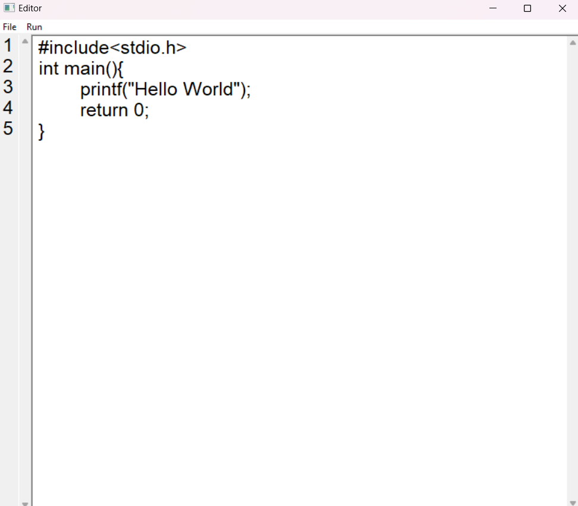

# Code Editor

This is a simple text editor with the ability to compile and run C, C++, and Python code. The editor features an easy-to-use interface for writing code, opening and saving files, and compiling them directly from the editor.



## Features

- **File Operations**:
  - Create a new file
  - Open existing files
  - Save files and Save As functionality
  - Close the application
  
- **Code Execution**:
  - Compile and run C and C++ code
  - Execute Python scripts

- **User Interface**:
  - TextBox for code editing
  - Static field for line numbers
  - Menu for file operations

## Requirements

- Windows operating system
- MinGW or GCC installed for compiling C/C++ code
- Python installed for executing Python scripts

## Compilation and Execution

1. **Download/Clone the Repository**:
   ```bash
   git clone https://github.com/ReaalSATYAM/CodeEditor.git
   ```

2. **Compile & Run**  
    ```bash
   cd CodeEditor
   gcc Editor.c -o Editor -mwindows  
   ./Editor.exe
   ```
3. **Using Executable File**
- Run the `Editor.exe` file directly from the repository folder.
- Or download the setup file `Code Editoe.exe`.

1. **Open the Editor:** Run the `editor.exe` file to launch the text editor.
2. **Edit Code:** Write or paste your code in the text box.
3. **File Operations:**
   - To create a new file, go to `File > New`.
   - To open a file, go to `File > Open File`.
   - To save a file, use `Ctrl + S` or go to `File > Save`.
   - To save the file as another name, go to `File > Save As`.
4. **Compile and Run:**
   - To compile and run the code, go to `Run `.
   - The output will be displayed in a new command prompt window.

## Hotkeys

- **Ctrl + S:** Save the current file.

# File Formats Supported

The editor supports the following file formats for opening and saving:

- C files (`.c`)
- C++ files (`.cpp`)
- Python files (`.py`)
- Text files (`.txt`)

[](mailto:satyamnaithani14@gmail.com)


[](https://www.linkedin.com/in/satyam-naithani-243076298/)

[](https://github.com/ReaalSATYAM)


# License

This project is open source and available under the MIT License.

